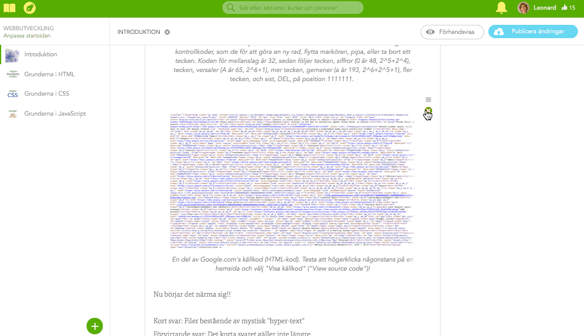

# smoothSort.js
*Adds smooth drag-n-drop sorting to any HTML list with a simple call.*
Currently requires jQuery.


## Quick start

1. Load jQuery.js
-  Load custom css (including specific rules for smoothSort lists, optional)  
   (eg. `ul.drag-active li.moving .handle:active, li.putting-into-place`)
-  Load smoothSort.js
-  Setup a list (eg. `<ul><li>Item <b class="handle">drag me</b></li></ul>`)
2. Invoke smoothSort
```javascript
$('ul').smoothSort({
  containerScale:1,
  dragEnd: function (opt, item, fromIndex, toIndex) {
    console.log('Drag ended', item, fromIndex, toIndex)
  }
});
```
6. Profit.


## Real-world example



*At [ludu.co](https://www.ludu.co), we use smoothSort.js to enable restructuring of lesson content with ease.*


## Features

- Adds drag-n-drop sorting functionality
- Autoscrolls dynamically when cursor gets close(r) to an edge
- Manual scrolling while dragging, and autoscrolling, works simultaneously
- Autoscrolls dropped item into view if put outside
- Leaves no traces in the DOM when not activly in use
- Items collapses to a max-height when dragged, if wanted (dragItemMaxHeight)
- Highly customisable
  - Structure-wise (container, scrolling container, item and handle can have multiple elements around and in-between)
  - Style-wise (custom animations, timings, classes, basically everything)
  - Action-wise (dragStart/Move/End/didInit; handlers for your code to thrive)
  - Master-wise (clean and commented code)
- Does things smoothly.


## Usage

```javascript
// Options
var opt = $.extend({
  container:$(this),
  containerScale:1,
  dragActiveClass:'drag-active',
  scrollContainer:$(this).parent(),
  scrollDistance:100, // px distance from top/bottom of scrollContainer, to activate autoScroll, or false
  scrollSpeed:10, // max nr of px/50ms
  scrollIntoViewDuration:700, // ms | false
  itemSelector:'li',
  dragItemMaxHeight:100, // px (including padding, excluding border and margin)
  dragItemClass:'moving',
  dragItemTransformStyle:null, // null | 'scale(1.05,1.05)' (appended to 'translate3D(...) ')
  handleSelector:'.handle',
  shouldPutIntoPlace:'animated', // true | false | 'animated'
  cssResetAnimationDelay:500, // if you got css like
  shouldAddDefaultCSS:'auto', // false | true | 'auto' (true if item's css transition value is the default "all 0s ease 0s")
  // li.putting-into-place {transition:max-height 500ms, transform 0.23s ease-out;}
  // then set to longest duration (in this case 500ms)

  // Events
  dragStart:function (opt) {},
  dragMove:function (opt) {},
  dragEnd:function (opt, item, fromIndex, toIndex) {},
  didInit:function (opt) {}
}, options);

// Callable functions
// (defined in "Functions" section)
opt.putIntoPlace = null;

// Read only variables
opt.dragItem = null;
opt.dragStartPosition       = { x:0, y:0 };
opt.dragAbsolutePosition    = { x:0, y:0 };
opt.dragDeltaTransform      = { x:0, y:0 };
opt.handleMargin            = { x:0, y:0 };
opt.dragItemInitialHeight   = 0;
opt.dragItemOriginalIndex   = null;
opt.dragItemVirtualIndex    = null;
opt.dragItemInnerSpacing    = getInnerSpacing();
opt.dragItemOuterSpacing    = getOuterSpacing();

opt.containerStartPosition  = { x:0, y:0 };
opt.containerStartSize      = { w:0, h:0 };

opt.scrollOffset            = { x:0, y:0 };
opt.scrollContainerPosition = { x:0, y:0 };
opt.scrollContainerSize     = { w:0, h:0 };
```

In event handlers, especially the following could be useful:
- this.dragItem
- this.dragItemOriginalIndex (fromIndex)
- this.dragItemVirtualIndex (toIndex)


## Todo

*Next up*

- Auto scroll edge and animate put back new translate offset
- Make containerScale work properly (When scaled, height-scaledHeight... get top offset and use)
- If initial drag is faster then next item move animation, next item could get a somewhat off "initial position" value (used for switch edge)
- Make sure autoscroll bottom works in Ludu
- Scroll area bottom not working in some cases (Search "opt.scrollContainerSize.h       =")
- dragStart x2 to fast after eachother yeilds unwanted animation+no maxheight (dragStart1, dragStart2, dragEnd1, ...), "reset" object if dragEnd not done before next dragStart


- Possible padding issue when applied to scrollContainer, affecting switch edge
- Move other items istead of dragItem when released if possible
- When should switch happen? Isn't perfect yet. (Search "// Where to react")
- Account for the velocity when releasing dragItem (mainly, change putBack transition speed (by reading and alter getComputedStyleValues maybe, or separate opt?) so initial is same as just before release (account for the easing as well))
- Allow drag outside container, but with rubber band effect (option)

- Separate "opt" objects (one for every list) and functionality (only one)
- Ability to remove smoothSort functionality (also remove defaultStyle if existing)
- Isolate set-an-item's-translate-position into a separate function

- Improved default css (+no reset should be needed if value not wanted, ex. opacity is a maybe -> skip it)
- If no handler specified, use the whole item (except buttons etc?) instead?
- Add default style on init (how to check item's style if there's none?)? (and remove if smoothSort functionality is removed)

- Browser support
- Touch support
- jQuery scroll animation somewhat laggy in safari (translate the whole container instead..?)
- Check out HTML5 drag 'n' drop, pros > cons?
- Rework away jQuery dependency.

- option to have containerScale opposite origin also centered
- option to have scrollDistance 'center': scroll percentage based so that dragPos/visible continer area height = scrollPos / scroll container height, what if initial drag pos and scroll pos does not equal the previus formula? Morph until they do?

- Add horizontal support
- Grid support (Horizontal + vertical)
- Auto-detect direction [horizontal | vertical | both] based on (container width not auto, but height auto -> vertical, etc) or (compare item1 and item2 position, if multiple and grid, figure out -"the item order"- when/where to switch)
- Better and horizontal gifs in the readme!

- Drag 'n' drop between lists (boolean options, allow: drag, drop, reorder)
- If about to drop into list, use function (as option) to evaluate if allow (shouldAcceptDropFromOtherList: function (opt, otherOpt, otherItem) {return opt.container.hasClass("recepieList");})
- If drag out of/into list, option snapDistance, snapEffect none | translate/transition (rubberband effect?).. use a css class? .moving-into-list, moving-out-of-list, outside-list with transition?
- Play with addEventListener('webkitmouseforcechanged', (e) => {e.webkitForce}? Usefull to alter snapDistance (light: snaps easy, longer distance, hard: snaps harder, shorter distanse)..?

- Add ability to wrap item's content so custom transform transitions (like scale) don't mess with dragItem's translate3d (the right way? maybe instead allow to use a js animation plugin and manualy animate custom properties while keeping translate3d based on drag delta)

- As an ember plugin?
- As an angular plugin?
- React js module?
- Fix gh-pages page
- Fix demo page
- Add .min.js
- Add badges
- Add tests
- Promote

- Add commercial license if possible and unintrusive
- Demo, take something from a list and throw it into a "3d"basket (one part over, and one under), take velocity into account
- Demo: Absolute positioned items on a curve. options isAboutToUpdatePosition(opt, item, pos) -> pos ?


---

Feel free to contribute, and to open issues/requests.

Originally created by Leonard Pauli  
Copyright © Leonard Pauli 2015-2016  

Date: 17/3-2015  
Rework: 20/2-2016  
Now: 17/4-2016  
License: MIT  